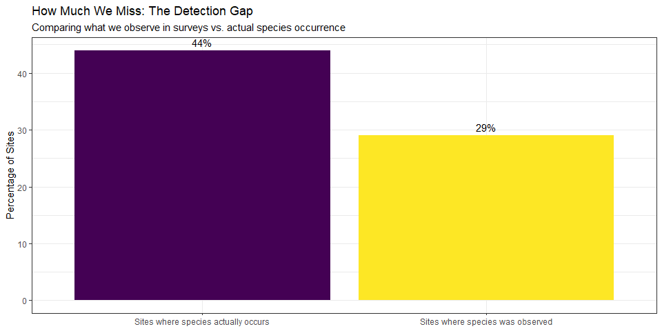
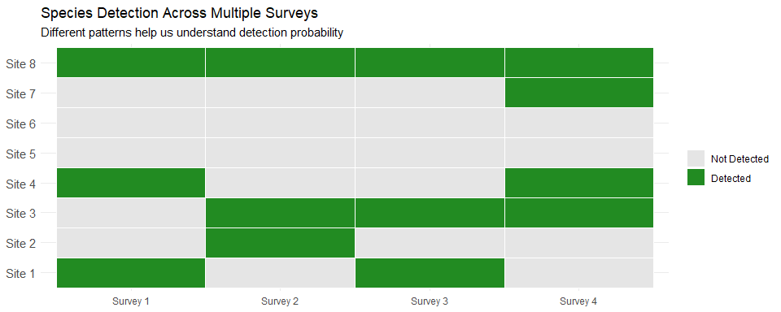
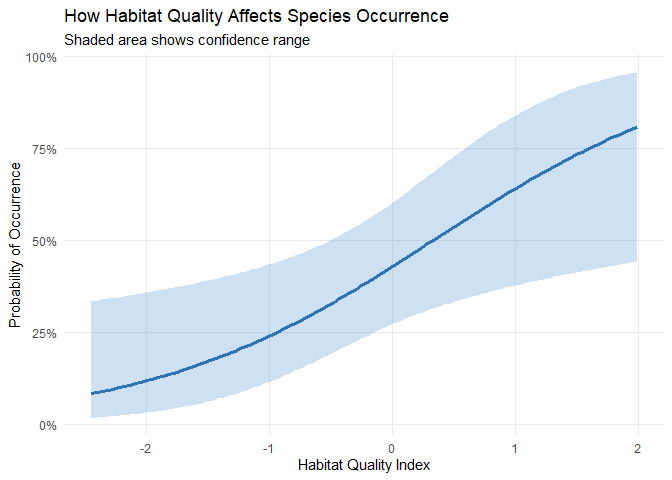
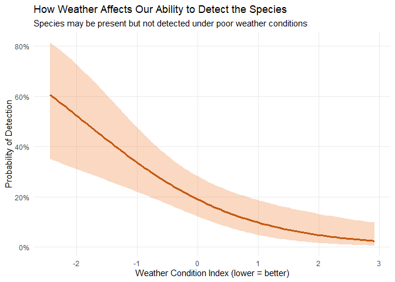
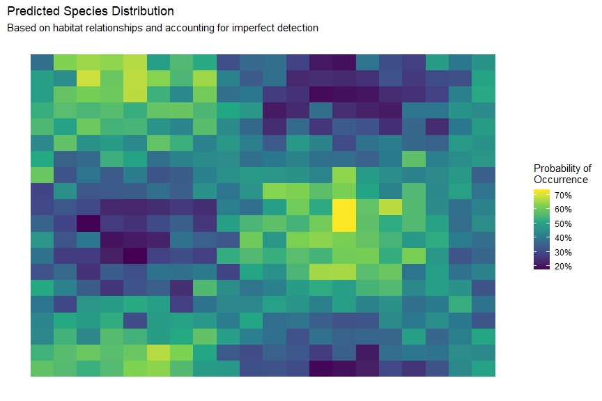

Advanced Statistical Techniques for Analyzing Ecological Monitoring Data
================
Kyle Rosenblad
2 April 2025

# Executive Summary

This document illustrates how cutting-edge statistical methods can help
us better understand where species live across a landscape, even when
our surveys sometimes fail to detect them. With an approach called
occupancy modeling, we can:

- **Account for imperfect detection** - Just because we don’t see a
  species doesn’t mean it is absent.
- **Identify important habitat features** that determine where a species
  occurs.
- **Create more accurate distribution maps** to inform conservation
  management.
- **Save time and money** by optimizing future monitoring schemes.

The methods shown here have been successfully applied to numerous
biodiversity monitoring programs and endangered species assessments.

# The Challenge: Understanding Species Distributions with Imperfect Data

Conservation planners face a common challenge: **How do we know where a
species truly lives?**

Survey data are valuable but can carry several important limitations:

- Species may go undetected even when they are present.

- Survey conditions may affect our ability to detect the species of
  interest.

- Limited resources mean we cannot monitor everywhere all the time, or
  even close.

## The Problem of Imperfect Detection

When we only look at raw survey data, we can **underestimate** where
species truly occur because our surveys failed to detect it in certain
locations:

<!-- -->

The chart above, for an example species, shows the gap between what we
observe during surveys and the actual species occurrence. This kind of
discrepancy often arises because:

1.  The species may be present but inactive during a survey.

2.  Weather conditions or other factors may animals’ behavior, and/or
    our ability to detect them.

3.  Dense vegetation or other habitat features might hide the species.

4.  We might simply not notice, correctly identify, or correctly record
    the species due to the imperfect nature of human observers. This
    also includes camera traps, AI, etc.–nobody is perfect!

# Our Approach: Accounting for Imperfect Detection

## How It Works

We use repeated surveys at the same locations over time to help us
understand how often we miss species when they’re actually present.

<!-- -->

By looking at these patterns, our statistical model can:

- Estimate the probability of detecting the species when it’s present

- Adjust our occupancy estimates to account for sites where the species
  was present but never detected

- Consider the effects of habitat and survey conditions

## The Benefits of Our Approach

Our modeling approach provides several key advantages:

<table class="table table-striped table-hover" style="width: auto !important; margin-left: auto; margin-right: auto;">
<thead>
<tr>
<th style="text-align:left;">
Benefit
</th>
<th style="text-align:left;">
Description
</th>
</tr>
</thead>
<tbody>
<tr>
<td style="text-align:left;font-weight: bold;">
More Accurate Distribution Maps
</td>
<td style="text-align:left;">
Accounts for locations where species was present but not detected
</td>
</tr>
<tr>
<td style="text-align:left;font-weight: bold;">
Identifies Key Habitat Features
</td>
<td style="text-align:left;">
Reveals which environmental factors determine where species occur, such
as temperature or tree cover
</td>
</tr>
<tr>
<td style="text-align:left;font-weight: bold;">
Quantifies Survey Effectiveness
</td>
<td style="text-align:left;">
Clarifies effects of survey conditions on our ability to find the
species of interest
</td>
</tr>
<tr>
<td style="text-align:left;font-weight: bold;">
Optimizes Future Survey Efforts
</td>
<td style="text-align:left;">
Helps design better surveys to maximize detection while minimizing costs
</td>
</tr>
</tbody>
</table>

# Results: What Drives This Species’ Distribution and Probability of Detection?

## Habitat Relationships

Our analysis reveals that our species is much more likely to occur in
high-quality habitat:

<!-- -->

This chart shows that:

- As habitat quality increases, the chance that the species is present
  increases.

- In poor-quality habitat, there’s less than a 25% chance of species
  occurrence.

- In high-quality habitat, there’s more than a 75% chance of species
  occurrence.

- The blue shaded area shows our confidence around our model’s
  estimates.

## Survey Effectiveness

Understanding how survey conditions affect our ability to detect the
species:

<!-- -->

Key insights:

- Weather affects our ability to detect the species.

- Under optimal conditions, if the species is present, we have about an
  80-90% chance of detecting it on average.

- Under the worst conditions, the chance of detecting the species, even
  when it is present, can drop to quite near zero. These would be
  wasteful days to survey!

- Repeat surveys are critical for understanding where the species is
  found, as well as how to optimize future monitoring strategies in
  light of factors that make detection difficult, like poor weather.

# Predicted Distribution Map

Based on our model, we can predict where the species is likely to occur
across an entire landscape:

<!-- -->

This map shows the estimated probability of the species occurring across
the landscape, with:

- Yellow areas representing high probability of occurrence (\>75%)
- Light blue and green areas representing moderate probability (25-75%)
- Dark blue areas representing low probability (\<25%)

## Management Implications

This distribution map helps conservation managers to:

1.  **Confidently prioritize conservation efforts** in areas with high
    occupancy probability
2.  **Target future surveys** in areas with moderate probability to
    improve knowledge of where the species is found
3.  **Identify the species’ preferred habitats** that should be
    protected or restored
4.  **Track changes over time** by repeating the analysis with new
    survey data and improved monitoring schemes

# Conclusions and Recommendations

Our analysis provides several key insights:

1.  **The species’ true distribution is more extensive** than raw survey
    data suggests
2.  **Habitat quality is a strong driver** of where this species occurs
3.  **Weather conditions substantially influence** our ability to detect
    the species
4.  **Repeated surveys are essential** for accurate distribution
    assessment

## Next Steps

Based on these findings, we recommend:

1.  **Prioritize protection** of high-quality habitat areas shown in
    dark blue
2.  **Avoid surveying in poor weather** to maximize detection and avoid
    wasting resources
3.  **Conduct at least 3-4 repeat visits** at each site for reliable
    results
4.  **Expand survey efforts** to areas with moderate occupancy
    probability to improve our understanding of where this species does
    and does not occur

------------------------------------------------------------------------

*This demonstration uses simulated data for a hypothetical species. For
your specific project, we would adapt these methods to your target
species and available data. Ideally, we can also help you design your
data collection strategy before you begin.* \`\`\`
