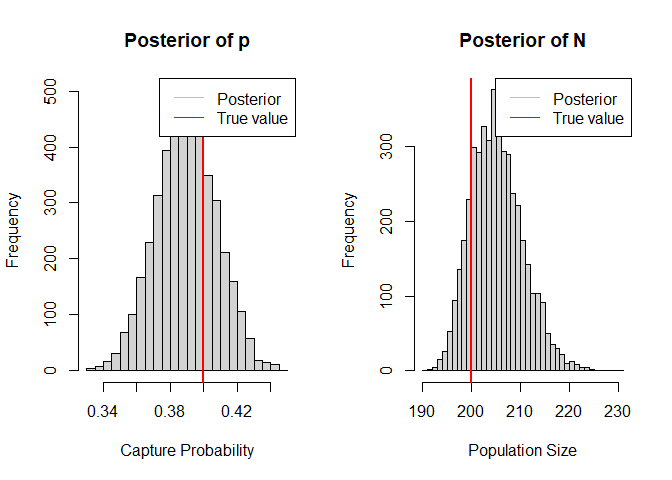
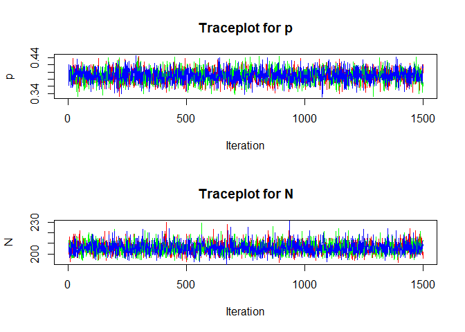
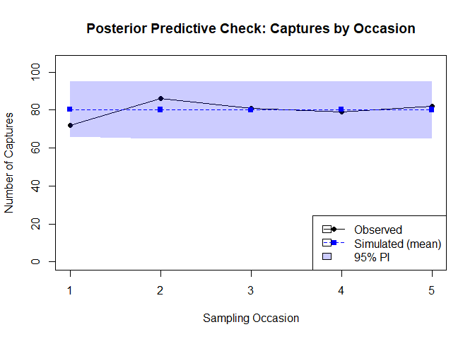
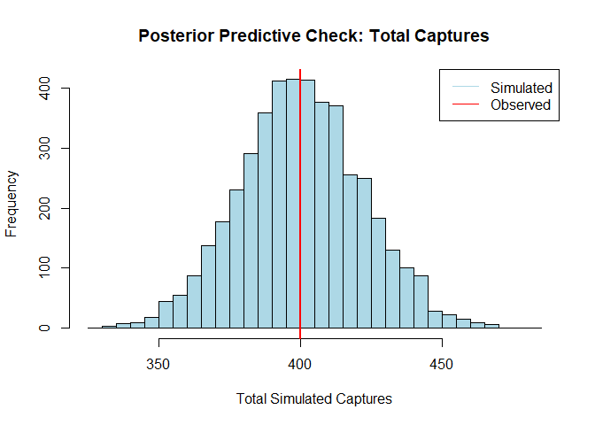

Bayesian Mark-Recapture with Data Augmentation in JAGS
================
Kyle Rosenblad
3 April 2025

## Introduction

This is a ‘colleague-facing’ demo showing how I would approach
collaboration with other quantitative ecologists or statisticians.

Mark-recapture models are hierarchical models often used for estimating
population sizes or other population-level parameters like survival
rates. The key insight is that when individuals are caught, marked,
released, and caught again in a subsequent capture event, the mix of
marked and unmarked individuals in the subsequent event gives us clues
as to the size of the population these individuals belong to.

This document demonstrates Bayesian occupancy modeling concepts and
implementation in R using JAGS. We will build a simple “closed
population”, in which we assume that individuals do not leave or enter
our population between capture events. This kind of model provides the
foundation for more complex approaches like open population models or
time-varying capture probabilities.

In this demo, we will:

1.  Simulate data from a simple closed population model–i.e., one with
    no individuals lost or gained from the population between recapture
    events.

2.  Fit a model with the same structure to the simulated data using JAGS
    with data augmentation (details below).

3.  Verify that the model’s parameter estimates are close to the true
    values.

4.  Run posterior predictive checks to ensure the model structure is a
    reasonable representation of the data-generating process.

## Required Packages

``` r
library(R2jags)
library(coda)
```

## Simulate Closed Population Mark-Recapture Data

``` r
# True parameters
n_true <- 200           # true population size
n_occasions <- 5        # number of sampling occasions
p_true <- 0.4           # capture probability (constant in this model)

# Simulate capture histories
# Rows are individuals, columns are sampling occasions
# 1 = captured, 0 = not captured

# Initialize empty capture history matrix to fill later
# with simulated capture data
z <- matrix(0, nrow = n_true, ncol = n_occasions)

# Simulate captures
for (i in 1:n_true) {
  for (t in 1:n_occasions) {
    # Each individual has probability p_true of being captured at each occasion
    z[i, t] <- rbinom(1, 1, p_true)
  }
}

# In real data, we'd only observe individuals that were captured at least once, so 
# let's extract just observed capture histories (individuals caught at least once)
ever_caught <- apply(z, 1, sum) > 0
CH_all <- z[ever_caught, ]

# Number of observed individuals
n_observed <- nrow(CH_all)

# Peek at a few example histories
head(CH_all)
```

    ##      [,1] [,2] [,3] [,4] [,5]
    ## [1,]    0    0    0    0    1
    ## [2,]    1    1    1    1    1
    ## [3,]    0    1    1    1    1
    ## [4,]    0    1    1    1    1
    ## [5,]    0    0    1    0    1
    ## [6,]    1    0    0    0    0

``` r
# Summary statistics
cat("True population size:", n_true, "\n")
```

    ## True population size: 200

``` r
cat("Number of observed individuals:", n_observed, "\n")
```

    ## Number of observed individuals: 188

``` r
cat("Number of sampling occasions:", n_occasions, "\n")
```

    ## Number of sampling occasions: 5

``` r
cat("Total captures:", sum(CH_all), "\n")
```

    ## Total captures: 400

``` r
cat("Observed capture frequencies by occasion:\n")
```

    ## Observed capture frequencies by occasion:

``` r
colSums(CH_all)
```

    ## [1] 72 86 81 79 82

## Data Augmentation Approach

The data augmentation approach adds a set of all-zero capture histories
(representing potential unobserved individuals) to the observed data.
Then we use an indicator parameter, which is part of our model, to
determine whether each individual is part of the population.

``` r
# Set the number of augmented individuals (should be much larger than expected N)
M <- 500

# Create the augmented data set
y_aug <- matrix(0, nrow = M, ncol = n_occasions)
y_aug[1:n_observed, ] <- CH_all

# Create a vector indicating which individuals were actually observed
# (1 for observed, NA for augmented)
z_init <- rep(NA, M)
z_init[1:n_observed] <- 1  # All observed individuals must be in the population

# Prepare data for JAGS
jags_data <- list(
  y = y_aug,            # Augmented capture histories
  M = M,                # Total augmented size
  n_occasions = n_occasions  # Number of occasions
)

# Define sensible places in parameter space for the MCMC sampler chains to begin
inits <- function() {
  list(
    z = z_init,
    p = runif(1, 0.2, 0.6),
    omega = runif(1, 0.2, 0.8)
  )
}
```

## JAGS Model with Data Augmentation

``` r
# Define the JAGS model
cat("
model {
  # Priors
  omega ~ dunif(0, 1)        # Inclusion probability (see augmentation above)
  p ~ dunif(0, 1)            # Capture probability
  
  # Latent inclusion state (z=1 if individual is in population, 0 otherwise)
  for (i in 1:M) {
    z[i] ~ dbern(omega)      # Inclusion indicator
    
    # Observation process - each occasion is a Bernoulli trial
    for (t in 1:n_occasions) {
      # Can only be captured if in population (z[i]=1)
      # The probability is p (capture probability) * z[i] (inclusion indicator)
      y[i,t] ~ dbern(p * z[i])
      
      # Generate replicate data for posterior predictive check
      y_sim[i,t] ~ dbern(p * z[i])
    }
  }
  
  # Derived parameters
  N <- sum(z[])               # Population size
  
  # Posterior predictive check statistics
  for (t in 1:n_occasions) {
    # Observed and simulated counts for each occasion
    n_obs[t] <- sum(y[1:M,t])
    n_sim[t] <- sum(y_sim[1:M,t])
  }
}
", file = "augmented_model.jags")
```

## Run JAGS Model

``` r
# Parameters to monitor
params <- c("p", "omega", "N", "n_obs", "n_sim")

# MCMC settings
n.chains <- 3
n.iter <- 20000
n.burnin <- 5000
n.thin <- 10

# Run JAGS
jags_fit <- jags(
  data = jags_data,
  parameters.to.save = params,
  model.file = "augmented_model.jags",
  inits = inits,
  n.chains = n.chains,
  n.iter = n.iter,
  n.burnin = n.burnin,
  n.thin = n.thin
)
```

    ## module glm loaded

    ## Compiling model graph
    ##    Resolving undeclared variables
    ##    Allocating nodes
    ## Graph information:
    ##    Observed stochastic nodes: 2500
    ##    Unobserved stochastic nodes: 3002
    ##    Total graph size: 6028
    ## 
    ## Initializing model
    ## 
    ##   |                                                          |                                                  |   0%  |                                                          |++++                                              |   8%  |                                                          |++++++++                                          |  16%  |                                                          |++++++++++++                                      |  24%  |                                                          |++++++++++++++++                                  |  32%  |                                                          |++++++++++++++++++++                              |  40%  |                                                          |++++++++++++++++++++++++                          |  48%  |                                                          |++++++++++++++++++++++++++++                      |  56%  |                                                          |++++++++++++++++++++++++++++++++                  |  64%  |                                                          |++++++++++++++++++++++++++++++++++++              |  72%  |                                                          |++++++++++++++++++++++++++++++++++++++++          |  80%  |                                                          |++++++++++++++++++++++++++++++++++++++++++++      |  88%  |                                                          |++++++++++++++++++++++++++++++++++++++++++++++++  |  96%  |                                                          |++++++++++++++++++++++++++++++++++++++++++++++++++| 100%
    ##   |                                                          |                                                  |   0%  |                                                          |*                                                 |   3%  |                                                          |***                                               |   5%  |                                                          |****                                              |   8%  |                                                          |*****                                             |  11%  |                                                          |*******                                           |  13%  |                                                          |********                                          |  16%  |                                                          |*********                                         |  19%  |                                                          |***********                                       |  21%  |                                                          |************                                      |  24%  |                                                          |*************                                     |  27%  |                                                          |***************                                   |  29%  |                                                          |****************                                  |  32%  |                                                          |*****************                                 |  35%  |                                                          |*******************                               |  37%  |                                                          |********************                              |  40%  |                                                          |*********************                             |  43%  |                                                          |***********************                           |  45%  |                                                          |************************                          |  48%  |                                                          |*************************                         |  51%  |                                                          |***************************                       |  53%  |                                                          |****************************                      |  56%  |                                                          |*****************************                     |  59%  |                                                          |*******************************                   |  61%  |                                                          |********************************                  |  64%  |                                                          |*********************************                 |  67%  |                                                          |***********************************               |  69%  |                                                          |************************************              |  72%  |                                                          |*************************************             |  75%  |                                                          |***************************************           |  77%  |                                                          |****************************************          |  80%  |                                                          |*****************************************         |  83%  |                                                          |*******************************************       |  85%  |                                                          |********************************************      |  88%  |                                                          |*********************************************     |  91%  |                                                          |***********************************************   |  93%  |                                                          |************************************************  |  96%  |                                                          |************************************************* |  99%  |                                                          |**************************************************| 100%

``` r
# Print results
print(jags_fit)
```

    ## Inference for Bugs model at "augmented_model.jags", fit using jags,
    ##  3 chains, each with 20000 iterations (first 5000 discarded), n.thin = 10
    ##  n.sims = 4500 iterations saved
    ##           mu.vect sd.vect     2.5%      25%      50%      75%    97.5%  Rhat n.eff
    ## N         205.689   5.315  197.000  202.000  205.000  209.000  217.000 1.001  4500
    ## n_obs[1]   72.000   0.000   72.000   72.000   72.000   72.000   72.000 1.000     1
    ## n_obs[2]   86.000   0.000   86.000   86.000   86.000   86.000   86.000 1.000     1
    ## n_obs[3]   81.000   0.000   81.000   81.000   81.000   81.000   81.000 1.000     1
    ## n_obs[4]   79.000   0.000   79.000   79.000   79.000   79.000   79.000 1.000     1
    ## n_obs[5]   82.000   0.000   82.000   82.000   82.000   82.000   82.000 1.000     1
    ## n_sim[1]   80.299   7.607   66.000   75.000   80.000   86.000   95.000 1.001  4500
    ## n_sim[2]   80.105   7.600   65.000   75.000   80.000   85.000   95.000 1.001  3100
    ## n_sim[3]   80.046   7.699   65.000   75.000   80.000   85.000   95.000 1.002  1500
    ## n_sim[4]   80.254   7.618   65.000   75.000   80.000   85.000   95.000 1.001  4500
    ## n_sim[5]   80.133   7.666   65.000   75.000   80.000   85.000   95.000 1.001  4500
    ## omega       0.412   0.024    0.364    0.395    0.411    0.429    0.460 1.001  4500
    ## p           0.389   0.018    0.354    0.378    0.389    0.401    0.424 1.001  4500
    ## deviance 1375.114  26.067 1330.606 1356.452 1372.585 1391.229 1428.727 1.001  4500
    ## 
    ## For each parameter, n.eff is a crude measure of effective sample size,
    ## and Rhat is the potential scale reduction factor (at convergence, Rhat=1).
    ## 
    ## DIC info (using the rule, pD = var(deviance)/2)
    ## pD = 339.8 and DIC = 1714.9
    ## DIC is an estimate of expected predictive error (lower deviance is better).

## Parameter Recovery and Diagnostics

``` r
# Extract MCMC samples
mcmc_array <- jags_fit$BUGSoutput$sims.array
mcmc_df <- as.data.frame(jags_fit$BUGSoutput$sims.matrix)

# Parameter recovery plots
par(mfrow = c(1, 2))

# Plot for capture probability
hist(mcmc_df$p, breaks = 30, main = "Posterior of p", xlab = "Capture Probability")
abline(v = p_true, col = "red", lwd = 2)
legend("topright", legend = c("Posterior", "True value"), 
       col = c("gray", "red"), lty = c(1, 1))

# Plot for population size
hist(mcmc_df$N, breaks = 30, main = "Posterior of N", xlab = "Population Size")
abline(v = n_true, col = "red", lwd = 2)
legend("topright", legend = c("Posterior", "True value"), 
       col = c("gray", "red"), lty = c(1, 1))
```

<!-- -->

``` r
# Traceplots for convergence check - showing all chains
par(mfrow = c(2, 1))
n_chains <- dim(mcmc_array)[2]
colors <- rainbow(n_chains)

# Traceplot for p
plot(mcmc_array[,1,"p"], type="l", col=colors[1], 
     main="Traceplot for p", ylab="p", xlab="Iteration")
if(n_chains > 1) {
  for(i in 2:n_chains) {
    lines(mcmc_array[,i,"p"], col=colors[i])
  }
}

# Traceplot for N
plot(mcmc_array[,1,"N"], type="l", col=colors[1], 
     main="Traceplot for N", ylab="N", xlab="Iteration")
if(n_chains > 1) {
  for(i in 2:n_chains) {
    lines(mcmc_array[,i,"N"], col=colors[i])
  }
}
```

<!-- -->

``` r
# Calculate 95% credible intervals
p_ci <- quantile(mcmc_df$p, c(0.025, 0.975))
N_ci <- quantile(mcmc_df$N, c(0.025, 0.975))

# Print parameter summaries
cat("Capture probability (p):\n")
```

    ## Capture probability (p):

``` r
cat("  True value:", p_true, "\n")
```

    ##   True value: 0.4

``` r
cat("  Posterior mean:", mean(mcmc_df$p), "\n")
```

    ##   Posterior mean: 0.3894743

``` r
cat("  95% credible interval:", p_ci[1], "to", p_ci[2], "\n")
```

    ##   95% credible interval: 0.3539206 to 0.4241627

``` r
cat("  True value in 95% CI:", p_true >= p_ci[1] & p_true <= p_ci[2], "\n\n")
```

    ##   True value in 95% CI: TRUE

``` r
cat("Population size (N):\n")
```

    ## Population size (N):

``` r
cat("  True value:", n_true, "\n")
```

    ##   True value: 200

``` r
cat("  Posterior mean:", mean(mcmc_df$N), "\n")
```

    ##   Posterior mean: 205.6887

``` r
cat("  95% credible interval:", N_ci[1], "to", N_ci[2], "\n")
```

    ##   95% credible interval: 197 to 217

``` r
cat("  True value in 95% CI:", n_true >= N_ci[1] & n_true <= N_ci[2], "\n")
```

    ##   True value in 95% CI: TRUE

## Posterior Predictive Checks

``` r
# Extract observed vs simulated counts from the matrix format
n_obs <- matrix(NA, nrow = nrow(mcmc_df), ncol = n_occasions)
n_sim <- matrix(NA, nrow = nrow(mcmc_df), ncol = n_occasions)

for (t in 1:n_occasions) {
  n_obs[, t] <- mcmc_df[, paste0("n_obs[", t, "]")]
  n_sim[, t] <- mcmc_df[, paste0("n_sim[", t, "]")]
}

# Calculate means and 95% CI for simulated counts
n_sim_mean <- colMeans(n_sim)
n_sim_lower <- apply(n_sim, 2, function(x) quantile(x, 0.025))
n_sim_upper <- apply(n_sim, 2, function(x) quantile(x, 0.975))

# Observed counts from data
obs_counts <- colSums(CH_all)

# Plot observed vs simulated
par(mfrow = c(1, 1))
plot(1:n_occasions, obs_counts, type = "o", pch = 16,
     ylim = c(0, max(n_sim_upper) * 1.1),
     xlab = "Sampling Occasion", ylab = "Number of Captures",
     main = "Posterior Predictive Check: Captures by Occasion")
lines(1:n_occasions, n_sim_mean, type = "o", pch = 15, lty = 2, col = "blue")

# Add 95% CI
polygon(c(1:n_occasions, rev(1:n_occasions)),
        c(n_sim_lower, rev(n_sim_upper)),
        border = NA, col = rgb(0, 0, 1, 0.2))
legend("bottomright", legend = c("Observed", "Simulated (mean)", "95% PI"),
       pch = c(16, 15, NA), lty = c(1, 2, NA), col = c("black", "blue", NA),
       fill = c(NA, NA, rgb(0, 0, 1, 0.2)))
```

<!-- -->

``` r
# Calculate Bayesian p-value for each occasion
p_values <- numeric(n_occasions)
for (t in 1:n_occasions) {
  p_values[t] <- mean(n_sim[, t] >= n_obs[, t])
  cat("Occasion", t, "- Bayesian p-value:", p_values[t], "\n")
}
```

    ## Occasion 1 - Bayesian p-value: 0.8708889 
    ## Occasion 2 - Bayesian p-value: 0.234 
    ## Occasion 3 - Bayesian p-value: 0.4748889 
    ## Occasion 4 - Bayesian p-value: 0.5922222 
    ## Occasion 5 - Bayesian p-value: 0.422

``` r
# Calculate Bayesian p-value for total captures
total_obs <- rowSums(n_obs)
total_sim <- rowSums(n_sim)
p_value_total <- mean(total_sim >= total_obs)
cat("\nBayesian p-value (total captures):", p_value_total, "\n")
```

    ## 
    ## Bayesian p-value (total captures): 0.5184444

``` r
# Plot total captures
hist(total_sim, breaks = 30, main = "Posterior Predictive Check: Total Captures",
     xlab = "Total Simulated Captures", col = "lightblue")
abline(v = sum(obs_counts), col = "red", lwd = 2)
legend("topright", legend = c("Simulated", "Observed"),
       lty = c(1, 1), col = c("lightblue", "red"))
```

<!-- -->

## Summary and Interpretation

We simulated data from a closed population mark-recapture model with: -
Population size (N) = 200 - Capture probability (p) = 0.4 - 5 sampling
occasions

Our JAGS model with data augmentation approach successfully recovered
two of the simulation’s parameter values.

1.  **Capture probability**: The posterior mean was close to the true
    value, and the true value was within the 95% credible interval.

2.  **Population size**: The posterior mean was close to the true value,
    and the true value was within the 95% credible interval.

The posterior predictive checks suggest the observed data would not be
unusual as outputs from our model. i.e., our model seems to represent
the data generating process well. - The observed number of captures at
each occasion falls well within the 95% credible intervals of the
simulated values. - The Bayesian p-values are close to 0.5, indicating a
good fit.

The data augmentation approach provides a robust framework for
implementing mark-recapture models in JAGS, allowing for proper
estimation of population size and capture probability. Many extensions
are possible. These will be explored in future demos.
