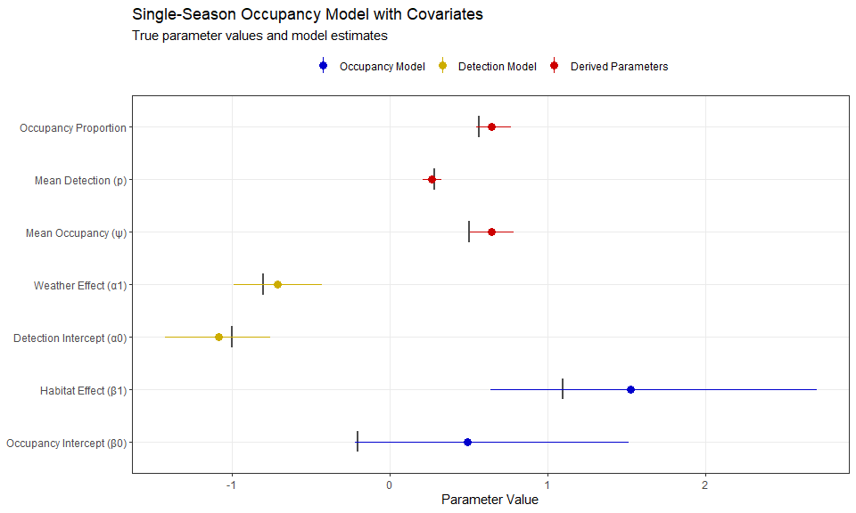

Bayesian Single-Season Occupancy Modeling Demo with JAGS and jagsUI
================
Kyle Rosenblad
2 April 2025

# Introduction to Occupancy Modeling

This is a ‘colleague-facing’ demo showing how I would approach
collaboration with other quantitative ecologists or statisticians.

Occupancy models are hierarchical models that separate the ecological
process–i.e., whether a species occupies a site–from the observation
process–i.e., whether a species that is present at a site is actually
detected during a survey. The key insight is that when a site is
surveyed multiple times, the resulting data can contain patterns that
help us disentangle these probabilities. For example, if a site is
surveyed four times, and our species of interest is detected in every
survey except the third, we might suspect it was really present all four
times, but the third survey just missed it. Furthermore, if the third
survey coincided with, for example, a bad weather day, we might even get
some idea of what factors influence detection probabilities.

This document demonstrates Bayesian occupancy modeling concepts and
implementation in R using JAGS software and the jagsUI R interface. We
will build a “single-season occupancy model”, in which we assume that
our species’ occupancy state (present or absent) does not change over
the course of our repeat surveys. This kind of model provides the
foundation for more complex approaches like dynamic or multi-season
occupancy models, which we will explore in subsequent demos.

## Required Packages

``` r
library(jagsUI)      # Interface to JAGS
library(ggplot2)     # For visualization
library(dplyr)       # For data wrangling
library(reshape2)    # For data wrangling
library(knitr)       # For producing tables
library(viridis)     # For specifying color palettes
set.seed(3289)        # For reproducibility
```

# Data Simulation

We’ll simulate a dataset with:

- 100 sites

- 5 repeat visits per site

- Probability of occupancy influenced by a habitat variable, topographic
  complexity

- Probability of detection influenced by weather conditions during each
  survey

``` r
# Number of sites and surveys
n_sites <- 100
n_surveys <- 5

# Create a site-level covariate for occupancy (e.g., topographic complexity)
topo_comp <- rnorm(n_sites)

# Create a survey-level covariate for detection (e.g., weather conditions)
weather <- matrix(rnorm(n_sites * n_surveys), n_sites, n_surveys)

# Set parameter values for the linear predictor in the
# occupancy process
beta0 <- -0.2  # Intercept
beta1 <- 1.1   # Effect of topographic complexity on occupancy

# Generate occupancy probabilities for each site
psi <- plogis(beta0 + beta1 * topo_comp)

# Set parameter values for the linear predictor in the
# detection process
alpha0 <- -1   # Intercept; this value keeps detection probabilities fairly low
alpha1 <- -0.8  # Effect of weather variable on detection

# Set up an empty matrix, which we'll fill with simulated observation data
y <- matrix(NA, n_sites, n_surveys)

# Generate true occupancy states, which we'll call z.
# This model is what we might call a single-season occupancy model, in which we
# assume that the true occupancy state at each site does not change across repeat # surveys.
z <- rbinom(n_sites, 1, psi)

# Simulate detection data
for (i in 1:n_sites) {
  for (j in 1:n_surveys) {
    # If the site is occupied (z=1),
    # each survey could yield a detection
    # or a non-detection
    if (z[i] == 1) {
      # Compute detection probability
      p <- plogis(alpha0 + alpha1 * weather[i, j])
      # Simulate detection or non-detection using this probability
      y[i, j] <- rbinom(1, 1, p)
    } else {
      # Site is unoccupied (z=0), so species cannot be detected
      y[i, j] <- 0
    }
  }
}

# Now we'll estimate occupancy naively, ignoring the issue of imperfect detection.
# In other words, we'll just compute the proportion of sites that had at least one # detection.
# Then below, we'll compare that against true occupancy, z.
naive_occupancy <- mean(apply(y, 1, function(x) any(x == 1)))
true_occupancy <- mean(z)

# Quick table for comparison:
comparison <- data.frame(
  Metric = c("Naive Occupancy", "True Occupancy"),
  Estimate = c(naive_occupancy, true_occupancy)
)
kable(comparison, digits = 3, caption = "Comparison of Naive and True Occupancy")
```

| Metric          | Estimate |
|:----------------|---------:|
| Naive Occupancy |     0.49 |
| True Occupancy  |     0.57 |

Comparison of Naive and True Occupancy

Depending on the study goals, this would likely be a concerning
difference between the true proportion of occupied sites and the naive
estimate.

Now let’s fit some occupancy models to account for this discrepancy.

# Fitting Bayesian Occupancy Models with JAGS

It’s a good idea to start with the simplest possible model structure and
then add features incrementally. This strategy helps us avoid confusing
ourselves or overlooking problems.

## 1. Basic Occupancy Model (Constant Occupancy and Detection)

First, we’ll assume that occupancy and detection probabilities do not
vary among sites or surveys. This is probably not realistic, but it’s a
good foundation from which to build more sophisticated models.

Here we define the JAGS model. This involves writing a separate model
file that will be read later (ss_occ_no_covariates.txt).

``` r
# Write JAGS model to a file
cat("
model {
  # Priors
  psi ~ dunif(0, 1)       # Occupancy probability
  p ~ dunif(0, 1)         # Detection probability
  
  # Occupancy process
  for (i in 1:n_sites) {
    z[i] ~ dbern(psi)     # True, unobserved occupancy state at each site
  }
  
  # Detection process
  for (i in 1:n_sites) {
    for (j in 1:n_surveys) {
      y[i,j] ~ dbern(z[i] * p)  # Observed detection data from each site and survey
    }
  }
  
  # A useful derived quantity
  occ_fs <- sum(z) / n_sites  # Occupancy proportion in our finite sample
}
", file = "ss_occ_no_covariates.txt")
```

Now let’s fit the model:

``` r
# JAGS wants input data in list form:
jags_data <- list(
  y = y,
  n_sites = n_sites,
  n_surveys = n_surveys
)

# Parameters to monitor during MCMC sampling:
params <- c("psi", "p", "z", "occ_fs")

# The MCMC sampler chains have to start somewhere in parameter space, so we'll
# write a function to initialize the chains in sensible ways. i.e., we'll allow plenty of randomness while avoiding problematic values, e.g. psi=0.
inits <- function() {
  list(
    z = apply(y, 1, max, na.rm = TRUE),  # Initialize z=1 where detections>0
    psi = runif(1, 0.01, 0.99),
    p = runif(1, 0.01, 0.99)
  )
}

# Run 3 MCMC sampler chains for 5000 generations each, discarding the first 1000
# as burn-in, so the chains will hopefully have time to mix properly. We'll check
# diagnostics later and consider whether we should discard more. We'll thin our
# samples by a factor of 4 since consecutive samples may be fairly autocorrelated.
n_chains <- 3
n_iter <- 5000
n_burnin <- 1000
n_thin <- 4

# Run JAGS model
# If you don't want to use 3 processor cores at once, you can change 'parallel'
# to false. Running in parallel suppresses progress output, so you might decide
# to change it to parallel=FALSE.
m0_jags <- jags(data = jags_data, 
               inits = inits,
               parameters.to.save = params,
               model.file = "ss_occ_no_covariates.txt",
               n.chains = n_chains,
               n.iter = n_iter,
               n.burnin = n_burnin,
               n.thin = n_thin,
               parallel=TRUE)
```

Let’s examine the results. Note that the “estimated” occupancy state for
some sites (z) is 1, with no uncertainty and thus no diagnostic output
like R-hat. This is to be expected because our model assumes that only
way a detection could’ve happened is if the species was really present.

For other parameters, we want to see large effective sample sizes–at
least 100 generally, or a few hundred is even better–and low R-hat
values close to 1. That’s what we’ll see below:

``` r
print(m0_jags)
```

    ## JAGS output for model 'ss_occ_no_covariates.txt', generated by jagsUI.
    ## Estimates based on 3 chains of 5000 iterations,
    ## adaptation = 100 iterations (sufficient),
    ## burn-in = 1000 iterations and thin rate = 4,
    ## yielding 3000 total samples from the joint posterior. 
    ## MCMC ran in parallel for 0.035 minutes at time 2025-04-03 23:40:19.144976.
    ## 
    ##             mean     sd    2.5%     50%   97.5% overlap0 f  Rhat n.eff
    ## psi        0.605  0.072   0.473   0.602   0.756    FALSE 1 1.003  1100
    ## p          0.287  0.035   0.220   0.287   0.357    FALSE 1 1.002  1130
    ## z[1]       0.232  0.422   0.000   0.000   1.000     TRUE 1 1.001  2726
    ## z[2]       0.229  0.420   0.000   0.000   1.000     TRUE 1 1.001  1538
    ## z[3]       0.236  0.424   0.000   0.000   1.000     TRUE 1 1.000  3000
    ## z[4]       0.224  0.417   0.000   0.000   1.000     TRUE 1 1.001  2054
    ## z[5]       0.232  0.422   0.000   0.000   1.000     TRUE 1 1.000  2954
    ## z[6]       0.246  0.431   0.000   0.000   1.000     TRUE 1 1.000  3000
    ## z[7]       0.232  0.422   0.000   0.000   1.000     TRUE 1 1.000  3000
    ## z[8]       1.000  0.000   1.000   1.000   1.000    FALSE 1    NA     1
    ## z[9]       0.215  0.411   0.000   0.000   1.000     TRUE 1 1.005   582
    ## z[10]      1.000  0.000   1.000   1.000   1.000    FALSE 1    NA     1
    ## z[11]      1.000  0.000   1.000   1.000   1.000    FALSE 1    NA     1
    ## z[12]      0.230  0.421   0.000   0.000   1.000     TRUE 1 1.000  3000
    ## z[13]      0.238  0.426   0.000   0.000   1.000     TRUE 1 1.001  1864
    ## z[14]      1.000  0.000   1.000   1.000   1.000    FALSE 1    NA     1
    ## z[15]      0.233  0.423   0.000   0.000   1.000     TRUE 1 1.000  3000
    ## z[16]      1.000  0.000   1.000   1.000   1.000    FALSE 1    NA     1
    ## z[17]      1.000  0.000   1.000   1.000   1.000    FALSE 1    NA     1
    ## z[18]      0.239  0.427   0.000   0.000   1.000     TRUE 1 1.000  2870
    ## z[19]      1.000  0.000   1.000   1.000   1.000    FALSE 1    NA     1
    ## z[20]      0.236  0.425   0.000   0.000   1.000     TRUE 1 1.001  1729
    ## z[21]      1.000  0.000   1.000   1.000   1.000    FALSE 1    NA     1
    ## z[22]      1.000  0.000   1.000   1.000   1.000    FALSE 1    NA     1
    ## z[23]      0.240  0.427   0.000   0.000   1.000     TRUE 1 1.000  3000
    ## z[24]      1.000  0.000   1.000   1.000   1.000    FALSE 1    NA     1
    ## z[25]      1.000  0.000   1.000   1.000   1.000    FALSE 1    NA     1
    ## z[26]      0.245  0.430   0.000   0.000   1.000     TRUE 1 1.000  3000
    ## z[27]      1.000  0.000   1.000   1.000   1.000    FALSE 1    NA     1
    ## z[28]      0.232  0.422   0.000   0.000   1.000     TRUE 1 1.000  3000
    ## z[29]      1.000  0.000   1.000   1.000   1.000    FALSE 1    NA     1
    ## z[30]      0.220  0.415   0.000   0.000   1.000     TRUE 1 1.000  3000
    ## z[31]      1.000  0.000   1.000   1.000   1.000    FALSE 1    NA     1
    ## z[32]      1.000  0.000   1.000   1.000   1.000    FALSE 1    NA     1
    ## z[33]      1.000  0.000   1.000   1.000   1.000    FALSE 1    NA     1
    ## z[34]      0.231  0.422   0.000   0.000   1.000     TRUE 1 1.000  3000
    ## z[35]      0.235  0.424   0.000   0.000   1.000     TRUE 1 1.004   669
    ## z[36]      1.000  0.000   1.000   1.000   1.000    FALSE 1    NA     1
    ## z[37]      1.000  0.000   1.000   1.000   1.000    FALSE 1    NA     1
    ## z[38]      0.234  0.424   0.000   0.000   1.000     TRUE 1 1.000  3000
    ## z[39]      0.225  0.418   0.000   0.000   1.000     TRUE 1 1.000  3000
    ## z[40]      1.000  0.000   1.000   1.000   1.000    FALSE 1    NA     1
    ## z[41]      1.000  0.000   1.000   1.000   1.000    FALSE 1    NA     1
    ## z[42]      0.231  0.421   0.000   0.000   1.000     TRUE 1 1.003   711
    ## z[43]      0.239  0.427   0.000   0.000   1.000     TRUE 1 1.000  3000
    ## z[44]      0.219  0.414   0.000   0.000   1.000     TRUE 1 1.000  3000
    ## z[45]      1.000  0.000   1.000   1.000   1.000    FALSE 1    NA     1
    ## z[46]      1.000  0.000   1.000   1.000   1.000    FALSE 1    NA     1
    ## z[47]      1.000  0.000   1.000   1.000   1.000    FALSE 1    NA     1
    ## z[48]      1.000  0.000   1.000   1.000   1.000    FALSE 1    NA     1
    ## z[49]      0.235  0.424   0.000   0.000   1.000     TRUE 1 1.000  3000
    ## z[50]      1.000  0.000   1.000   1.000   1.000    FALSE 1    NA     1
    ## z[51]      0.228  0.420   0.000   0.000   1.000     TRUE 1 1.000  3000
    ## z[52]      1.000  0.000   1.000   1.000   1.000    FALSE 1    NA     1
    ## z[53]      0.231  0.422   0.000   0.000   1.000     TRUE 1 1.000  3000
    ## z[54]      0.210  0.407   0.000   0.000   1.000     TRUE 1 1.000  3000
    ## z[55]      1.000  0.000   1.000   1.000   1.000    FALSE 1    NA     1
    ## z[56]      1.000  0.000   1.000   1.000   1.000    FALSE 1    NA     1
    ## z[57]      0.242  0.429   0.000   0.000   1.000     TRUE 1 1.000  3000
    ## z[58]      1.000  0.000   1.000   1.000   1.000    FALSE 1    NA     1
    ## z[59]      0.229  0.420   0.000   0.000   1.000     TRUE 1 1.000  3000
    ## z[60]      0.214  0.410   0.000   0.000   1.000     TRUE 1 1.004   667
    ## z[61]      0.222  0.416   0.000   0.000   1.000     TRUE 1 1.000  3000
    ## z[62]      0.228  0.419   0.000   0.000   1.000     TRUE 1 1.000  3000
    ## z[63]      1.000  0.000   1.000   1.000   1.000    FALSE 1    NA     1
    ## z[64]      1.000  0.000   1.000   1.000   1.000    FALSE 1    NA     1
    ## z[65]      0.230  0.421   0.000   0.000   1.000     TRUE 1 1.001  1954
    ## z[66]      0.233  0.423   0.000   0.000   1.000     TRUE 1 1.001  1856
    ## z[67]      0.239  0.426   0.000   0.000   1.000     TRUE 1 1.000  3000
    ## z[68]      1.000  0.000   1.000   1.000   1.000    FALSE 1    NA     1
    ## z[69]      0.227  0.419   0.000   0.000   1.000     TRUE 1 1.001  2575
    ## z[70]      0.249  0.432   0.000   0.000   1.000     TRUE 1 1.000  3000
    ## z[71]      0.229  0.420   0.000   0.000   1.000     TRUE 1 1.000  2985
    ## z[72]      1.000  0.000   1.000   1.000   1.000    FALSE 1    NA     1
    ## z[73]      0.226  0.418   0.000   0.000   1.000     TRUE 1 1.002  1106
    ## z[74]      1.000  0.000   1.000   1.000   1.000    FALSE 1    NA     1
    ## z[75]      0.225  0.418   0.000   0.000   1.000     TRUE 1 1.000  3000
    ## z[76]      1.000  0.000   1.000   1.000   1.000    FALSE 1    NA     1
    ## z[77]      0.230  0.421   0.000   0.000   1.000     TRUE 1 1.000  3000
    ## z[78]      1.000  0.000   1.000   1.000   1.000    FALSE 1    NA     1
    ## z[79]      0.215  0.411   0.000   0.000   1.000     TRUE 1 1.000  3000
    ## z[80]      0.238  0.426   0.000   0.000   1.000     TRUE 1 1.000  3000
    ## z[81]      1.000  0.000   1.000   1.000   1.000    FALSE 1    NA     1
    ## z[82]      1.000  0.000   1.000   1.000   1.000    FALSE 1    NA     1
    ## z[83]      1.000  0.000   1.000   1.000   1.000    FALSE 1    NA     1
    ## z[84]      1.000  0.000   1.000   1.000   1.000    FALSE 1    NA     1
    ## z[85]      1.000  0.000   1.000   1.000   1.000    FALSE 1    NA     1
    ## z[86]      1.000  0.000   1.000   1.000   1.000    FALSE 1    NA     1
    ## z[87]      0.231  0.421   0.000   0.000   1.000     TRUE 1 1.002  1262
    ## z[88]      0.236  0.425   0.000   0.000   1.000     TRUE 1 1.003   800
    ## z[89]      1.000  0.000   1.000   1.000   1.000    FALSE 1    NA     1
    ## z[90]      1.000  0.000   1.000   1.000   1.000    FALSE 1    NA     1
    ## z[91]      0.237  0.425   0.000   0.000   1.000     TRUE 1 1.000  3000
    ## z[92]      0.227  0.419   0.000   0.000   1.000     TRUE 1 1.001  1497
    ## z[93]      0.240  0.427   0.000   0.000   1.000     TRUE 1 1.001  2238
    ## z[94]      0.247  0.432   0.000   0.000   1.000     TRUE 1 1.000  2905
    ## z[95]      1.000  0.000   1.000   1.000   1.000    FALSE 1    NA     1
    ## z[96]      1.000  0.000   1.000   1.000   1.000    FALSE 1    NA     1
    ## z[97]      1.000  0.000   1.000   1.000   1.000    FALSE 1    NA     1
    ## z[98]      1.000  0.000   1.000   1.000   1.000    FALSE 1    NA     1
    ## z[99]      1.000  0.000   1.000   1.000   1.000    FALSE 1    NA     1
    ## z[100]     0.222  0.416   0.000   0.000   1.000     TRUE 1 1.001  2605
    ## occ_fs     0.608  0.053   0.530   0.600   0.730    FALSE 1 1.006   718
    ## deviance 362.264 17.273 334.074 360.201 401.242    FALSE 1 1.004   828
    ## 
    ## **WARNING** Some Rhat values could not be calculated.
    ## Successful convergence based on Rhat values (all < 1.1). 
    ## Rhat is the potential scale reduction factor (at convergence, Rhat=1). 
    ## For each parameter, n.eff is a crude measure of effective sample size. 
    ## 
    ## overlap0 checks if 0 falls in the parameter's 95% credible interval.
    ## f is the proportion of the posterior with the same sign as the mean;
    ## i.e., our confidence that the parameter is positive or negative.
    ## 
    ## DIC info: (pD = var(deviance)/2) 
    ## pD = 148.9 and DIC = 511.178 
    ## DIC is an estimate of expected predictive error (lower is better).

``` r
# Check convergence
rbind(
  psi_Rhat = m0_jags$Rhat$psi,
  p_Rhat = m0_jags$Rhat$p
)
```

    ##              [,1]
    ## psi_Rhat 1.002545
    ## p_Rhat   1.002128

``` r
# Save some outputs for a visual comparison of true and estimated parameter values
true_values <- c(
  mean(psi),  # Average occupancy probability
  mean(plogis(alpha0 + alpha1 * weather[z == 1, ])),  # Average detection probability for occupied sites
  mean(z)  # True proportion of sites occupied
)
estimated_values <- c(m0_jags$mean$psi, m0_jags$mean$p, m0_jags$mean$occ_fs)
```

Now let’s visually compare the known true parameter values with our
model’s estimates:

``` r
# Create data frame for parameter comparisons
param_comparison <- data.frame(
  Parameter = c("Occupancy Probability (ψ)", "Detection Probability (p)", "Occupancy Proportion"),
  true_value = true_values,
  Estimated = estimated_values,
  LowerCI = c(m0_jags$q2.5$psi, m0_jags$q2.5$p, m0_jags$q2.5$occ_fs),
  UpperCI = c(m0_jags$q97.5$psi, m0_jags$q97.5$p, m0_jags$q97.5$occ_fs)
)

# Coefficient plot with error bars
ggplot(param_comparison, aes(x = Parameter, y = Estimated)) +
  geom_errorbar(aes(ymin=true_value, ymax=true_value), width=0.4, color = "gray30", size=1) +
  geom_point(size = 3, color = "red3") +
  geom_linerange(aes(ymin = LowerCI, ymax = UpperCI), width = 0.2, color = "red3") +
  labs(title = "Single-Season Occupancy Model, No Covariates",
       subtitle = "True parameter values and model estimates (red)",
       y = "Parameter Value") +
  theme_bw() +
  theme(axis.title.y=element_blank())+
  coord_flip()
```

<!-- -->

Pretty good! Now we’ll try the more sophisticated model.

## 2. Model with Covariates for Occupancy and Detection

Let’s define the more complex model with covariates:

``` r
# Write JAGS model to a file
cat("
model {
  # Priors for occupancy parameters
  beta0 ~ dnorm(0, 0.1)  # Intercept
  beta1 ~ dnorm(0, 0.1)  # Topography effect
  
  # Priors for detection parameters
  alpha0 ~ dnorm(0, 0.1)  # Intercept
  alpha1 ~ dnorm(0, 0.1)  # Weather effect
  
  # Occupancy process
  for (i in 1:n_sites) {
    logit(psi[i]) <- beta0 + beta1 * habitat[i]  # Occupancy probability
    z[i] ~ dbern(psi[i])                         # True, unobserved occupancy state at each site
  }
  
  # Detection process
  for (i in 1:n_sites) {
    for (j in 1:n_surveys) {
      logit(p[i,j]) <- alpha0 + alpha1 * weather[i,j]  # Detection probability
      y[i,j] ~ dbern(z[i] * p[i,j])                    # Detection given occupancy
    }
  }
  
  # Some useful derived quantities
  occ_fs <- sum(z) / n_sites  # Occupancy proportion in our finite sample
  
  # Mean occupancy across sites
  mean_psi <- mean(psi)
  
  # Mean detection across surveys
  mean_p <- mean(p)
}
", file = "ss_occ_with_covariates.txt")
```

Now let’s fit the full model. Note that you don’t have to run the MCMC
chains in parallel if you prefer to see real-time progress updates; see
comments below.

``` r
# Set up data as a list like last model:
jags_data <- list(
  y = y,
  habitat = topo_comp,
  weather = weather,
  n_sites = n_sites,
  n_surveys = n_surveys
)

# Parameters to monitor during MCMC sampling:
params <- c("beta0", "beta1", "alpha0", "alpha1", "psi", "p", "z", "occ_fs", "mean_psi", "mean_p")

# Draw 'inits' from sensible distributions for MCMC sampler like before
inits <- function() {
  list(
    z = apply(y, 1, max, na.rm = TRUE),
    beta0 = rnorm(1, 0, 1),
    beta1 = rnorm(1, 0, 1),
    alpha0 = rnorm(1, 0, 1),
    alpha1 = rnorm(1, 0, 1)
  )
}

# Run JAGS model
m1_jags <- jags(data = jags_data, 
               inits = inits,
               parameters.to.save = params,
               model.file = "ss_occ_with_covariates.txt",
               n.chains = n_chains,
               n.iter = n_iter,
               n.burnin = n_burnin,
               n.thin = n_thin,
               parallel=TRUE)
```

Let’s do some quick checks on the performance of the full model with
covariates. This time I won’t ‘print’ the full output since we have
several hundred parameters now, but we could do it using the same syntax
as we used for the simpler model. If you do try this on your own, you’ll
see it all looks pretty good.

``` r
# Check convergence for key parameters
rbind(
  beta0_Rhat = m1_jags$Rhat$beta0,
  beta1_Rhat = m1_jags$Rhat$beta1,
  alpha0_Rhat = m1_jags$Rhat$alpha0,
  alpha1_Rhat = m1_jags$Rhat$alpha1
)
```

    ##                 [,1]
    ## beta0_Rhat  1.002116
    ## beta1_Rhat  1.000298
    ## alpha0_Rhat 1.001758
    ## alpha1_Rhat 1.000188

``` r
# Compare coefficients with true values
true_coefs <- c(beta0, beta1, alpha0, alpha1)
estimated_coefs <- c(m1_jags$mean$beta0, m1_jags$mean$beta1, 
                     m1_jags$mean$alpha0, m1_jags$mean$alpha1)

coef_comparison <- data.frame(
  Parameter = c("Occupancy Intercept (β₀)", "Habitat Effect (β₁)",
                "Detection Intercept (α₀)", "Weather Effect (α₁)"),
  true_value = true_coefs,
  Estimated = estimated_coefs,
  LowerCI = c(m1_jags$q2.5$beta0, m1_jags$q2.5$beta1, 
              m1_jags$q2.5$alpha0, m1_jags$q2.5$alpha1),
  UpperCI = c(m1_jags$q97.5$beta0, m1_jags$q97.5$beta1, 
              m1_jags$q97.5$alpha0, m1_jags$q97.5$alpha1)
)

kable(coef_comparison, digits = 3, caption = "Comparison of True and Estimated Coefficients")
```

| Parameter                | true_value | Estimated | LowerCI | UpperCI |
|:-------------------------|-----------:|----------:|--------:|--------:|
| Occupancy Intercept (β₀) |       -0.2 |     0.493 |  -0.219 |   1.519 |
| Habitat Effect (β₁)      |        1.1 |     1.525 |   0.638 |   2.707 |
| Detection Intercept (α₀) |       -1.0 |    -1.082 |  -1.422 |  -0.752 |
| Weather Effect (α₁)      |       -0.8 |    -0.707 |  -0.988 |  -0.426 |

Comparison of True and Estimated Coefficients

# Visualization

Let’s run some more sophisticated visualizations of key model results:

``` r
# Extract posterior samples
mcmc_samples <- as.matrix(m1_jags$samples)

# Get posterior draws of predicted occupancy probability across a gradient of
# topographic complexity, conditioning on the mean values of other model parameters
topo_seq <- seq(min(topo_comp), max(topo_comp), length.out = 100)
n_samples <- nrow(mcmc_samples)
psi_pred <- matrix(NA, nrow = n_samples, ncol = length(topo_seq))
for (i in 1:n_samples) {
  beta0_sample <- mcmc_samples[i, "beta0"]
  beta1_sample <- mcmc_samples[i, "beta1"]
  psi_pred[i, ] <- plogis(beta0_sample + beta1_sample * topo_seq)
}

# Get means and credible intervals
psi_mean <- colMeans(psi_pred)
psi_lower <- apply(psi_pred, 2, quantile, probs = 0.025)
psi_upper <- apply(psi_pred, 2, quantile, probs = 0.975)

# Set up plot data
habitat_plot_data <- data.frame(
  habitat = topo_seq,
  psi_mean = psi_mean,
  psi_lower = psi_lower,
  psi_upper = psi_upper
)

# Plot occupancy vs topographic complexity
ggplot(habitat_plot_data, aes(x = habitat, y = psi_mean)) +
  geom_ribbon(aes(ymin = psi_lower, ymax = psi_upper), alpha = 0.3) +
  geom_line() +
  labs(x = "Topographic Complexity", y = "Occupancy Probability") +
  theme_bw()
```

<!-- -->

``` r
# Make a similar plot for detection probability and weather, again conditioning 
# on the means of parameters not represented in the plot
weather_seq <- seq(min(weather), max(weather), length.out = 100)
p_pred <- matrix(NA, nrow = n_samples, ncol = length(weather_seq))

for (i in 1:n_samples) {
  alpha0_sample <- mcmc_samples[i, "alpha0"]
  alpha1_sample <- mcmc_samples[i, "alpha1"]
  p_pred[i, ] <- plogis(alpha0_sample + alpha1_sample * weather_seq)
}

p_mean <- colMeans(p_pred)
p_lower <- apply(p_pred, 2, quantile, probs = 0.025)
p_upper <- apply(p_pred, 2, quantile, probs = 0.975)

weather_plot_data <- data.frame(
  weather = weather_seq,
  p_mean = p_mean,
  p_lower = p_lower,
  p_upper = p_upper
)

ggplot(weather_plot_data, aes(x = weather, y = p_mean)) +
  geom_ribbon(aes(ymin = p_lower, ymax = p_upper), alpha = 0.3) +
  geom_line() +
  labs(x = "Weather Condition", y = "Detection Probability") +
  theme_bw()
```

<!-- -->

Cool, occupancy and detection vary as expected with topographic
complexity and weather conditions, respectively. Let’s run another
informative kind of check:

``` r
# Compare estimated vs true occupancy across sites
site_comparison <- data.frame(
  Site = 1:n_sites,
  True_Psi = psi,
  Estimated_Psi = m1_jags$mean$psi,
  Lower_CI = m1_jags$q2.5$psi,
  Upper_CI = m1_jags$q97.5$psi,
  True_Z = z,
  Estimated_Z = m1_jags$mean$z
)

# Plot estimates. A perfect estimate is right on the black 1:1 line.
ggplot(site_comparison, aes(x = True_Psi, y = Estimated_Psi)) +
  coord_fixed()+
  geom_point(alpha = 0.4, color="blue") +
  geom_abline(intercept = 0, slope = 1) +
  geom_errorbar(aes(ymin = Lower_CI, ymax = Upper_CI), alpha = 0.1, color="blue") +
  labs(x = "True Occupancy Probability", y = "Estimated Occupancy Probability") +
  theme_bw()
```

<!-- -->

Not bad. Looks like there’s a bit of overestimation at the lower end of
the range of occupancy probability, and a bit of underestimation at the
upper end. In a formal project, we might interrogate this further and
try some tweaks to address it, but for this high-level demo, we’ll move
on.

Let’s run a posterior predictive check, a common tool for Bayesian model
diagnostics, in which we see whether the observed data are realistic for
the data generating process we’ve inferred. We’ll implement this in
DHARMa, which uses a flexible quantile residual approach suitable for
many types of models.

``` r
# Load the DHARMa package for diagnostic plots
library(DHARMa)

# Set up the structure of y
if(length(dim(y)) == 3) {
  n_species <- dim(y)[1]
  n_sites <- dim(y)[2]
  n_visits <- dim(y)[3]
} else if(length(dim(y)) == 2) {
  n_species <- 1
  n_sites <- dim(y)[1]
  n_visits <- dim(y)[2]
} else {
  stop("Unexpected dimension of data matrix y") # in case data set has unanticipated structure in future use
}

# print dimensions; may help in debugging
cat("Data dimensions:", n_species, "species,", n_sites, "sites,", n_visits, "visits\n")
```

    ## Data dimensions: 1 species, 100 sites, 5 visits

``` r
# thin posterior samples for computational efficiency
n_sims <- dim(m1_jags$sims.list$z)[1]
sim_indices <- sample(1:n_sims, min(100, n_sims))  # thin to 100

# get matrix of observed data, and flatten to fit what DHARMa expects
if(length(dim(y)) == 3) {
  # Multi-species data
  y_obs <- matrix(NA, nrow = n_species * n_sites, ncol = n_visits)
  for (i in 1:n_species) {
    for (j in 1:n_sites) {
      y_obs[(i-1)*n_sites + j, ] <- y[i, j, ]
    }
  }
} else {
  y_obs <- y
}

# array for simulated data
y_sim <- array(NA, dim = c(nrow(y_obs), ncol(y_obs), length(sim_indices)))

# get posterior draws of z and p from jagsUI object
z_samples <- m1_jags$sims.list$z
p_samples <- m1_jags$sims.list$p

# check dimensions and structure of posterior samples
cat("z_samples dimensions:", paste(dim(z_samples), collapse = " x "), "\n")
```

    ## z_samples dimensions: 3000 x 100

``` r
cat("p_samples dimensions:", paste(dim(p_samples), collapse = " x "), "\n")
```

    ## p_samples dimensions: 3000 x 100 x 5

``` r
# posterior predictive simulation
for (s in 1:length(sim_indices)) {
  idx <- sim_indices[s]
  
  if(length(dim(y)) == 3) {
    # to accommodate multi-species in future use
    for (i in 1:n_species) {
      for (j in 1:n_sites) {
        # get occupancy state for this species at this site
        z_ij <- z_samples[idx, i, j]
        # get detection probability for this species
        p_i <- p_samples[idx, i]
        
        # simulate detections for each site visit
        for (k in 1:n_visits) {
          if(z_ij == 1) {
            y_sim[(i-1)*n_sites + j, k, s] <- rbinom(1, 1, p_i)
          } else {
            y_sim[(i-1)*n_sites + j, k, s] <- 0
          }
        }
      }
    }
  } else {
    # single species model
    for (j in 1:n_sites) {
      # get occupancy state for this site
      z_j <- z_samples[idx, j]
      # get detection probability (may vary by site or be constant depending on
      # model structure)
      if(length(dim(p_samples)) == 2) {
        p_j <- p_samples[idx, j]
      } else {
        p_j <- p_samples[idx]
      }
      
      # simulate detections for each visit
      for (k in 1:n_visits) {
        if(z_j == 1) {
          y_sim[j, k, s] <- rbinom(1, 1, p_j)
        } else {
          y_sim[j, k, s] <- 0
        }
      }
    }
  }
}

# convert to format DHARMa expects
flat_y_obs <- as.vector(y_obs)
flat_y_sim <- matrix(NA, nrow = length(flat_y_obs), ncol = length(sim_indices))

for (s in 1:length(sim_indices)) {
  flat_y_sim[, s] <- as.vector(y_sim[, , s])
}

# create DHARMa object
dharma_obj <- createDHARMa(
  simulatedResponse = flat_y_sim,
  observedResponse = flat_y_obs,
  integerResponse = TRUE,
  method = "PIT"
)

# Create DHARMa diagnostic plots
plot(dharma_obj)
```

<!-- -->

``` r
# test for overdispersion and zero-inflation
# these are not really issues for binary data, but I'll take the opportunity to
# show how smoothly DHARMa does this.
testDispersion(dharma_obj)
```

<!-- -->

    ## 
    ##  DHARMa nonparametric dispersion test via sd of residuals fitted vs. simulated
    ## 
    ## data:  simulationOutput
    ## dispersion = 0.96438, p-value = 0.64
    ## alternative hypothesis: two.sided

``` r
testZeroInflation(dharma_obj)
```

<!-- -->

    ## 
    ##  DHARMa zero-inflation test via comparison to expected zeros with simulation
    ##  under H0 = fitted model
    ## 
    ## data:  simulationOutput
    ## ratioObsSim = 0.98965, p-value = 0.72
    ## alternative hypothesis: two.sided

``` r
# Create a DHARMa residual plot against predicted detection probability
if(length(dim(y)) == 3) {
  # for multi-species model
  p_pred <- array(dim = c(n_species * n_sites, n_visits))
  p_mean <- m1_jags$mean$p
  z_mean <- m1_jags$mean$z
  
  for (i in 1:n_species) {
    for (j in 1:n_sites) {
      # predicted detection = p * z
      p_pred[(i-1)*n_sites + j, ] <- p_mean[i] * z_mean[i, j]
    }
  }
} else {
  # for single species model
  p_pred <- matrix(nrow = n_sites, ncol = n_visits)
  if(length(dim(m1_jags$mean$p)) == 0) {
    # for constant detection probability
    p_mean <- m1_jags$mean$p
    for (j in 1:n_sites) {
      p_pred[j, ] <- p_mean * m1_jags$mean$z[j]
    }
  } else {
    # for site-specific detection probability
    p_mean <- m1_jags$mean$p
    for (j in 1:n_sites) {
      p_pred[j, ] <- p_mean[j] * m1_jags$mean$z[j]
    }
  }
}

# flatten p_pred to match the residuals
flat_p_pred <- as.vector(p_pred)
plotResiduals(dharma_obj, flat_p_pred, xlab = "Predicted Detection Probability", 
              main = "DHARMa Residuals vs. Predicted Detection")
```

<!-- -->

Looks like a bit of a trend in residuals versus predictions. Again, for
a formal project, we’d keep tweaking, but for now let’s move on.

Next we’ll look at a visual summary of the known true parameter values
and our model’s estimates, as we did for the simpler model:

``` r
# Set up dataframe for full model parameter comparisons
full_param_comparison <- data.frame(
  parameter = c("Occupancy Intercept (β0)", 
                "Habitat Effect (β1)",
                "Detection Intercept (α0)", 
                "Weather Effect (α1)",
                "Mean Occupancy (ψ)", 
                "Mean Detection (p)",
                "Occupancy Proportion"),
  true_value = c(beta0, 
                beta1, 
                alpha0, 
                alpha1,
                mean(psi), 
                mean(plogis(alpha0 + alpha1 * weather[z == 1, ])), 
                mean(z)),
  estimated = c(m1_jags$mean$beta0, 
               m1_jags$mean$beta1, 
               m1_jags$mean$alpha0, 
               m1_jags$mean$alpha1,
               m1_jags$mean$mean_psi, 
               m1_jags$mean$mean_p, 
               m1_jags$mean$occ_fs),
  lowerci = c(m1_jags$q2.5$beta0, 
             m1_jags$q2.5$beta1, 
             m1_jags$q2.5$alpha0, 
             m1_jags$q2.5$alpha1,
             m1_jags$q2.5$mean_psi, 
             m1_jags$q2.5$mean_p, 
             m1_jags$q2.5$occ_fs),
  upperci = c(m1_jags$q97.5$beta0, 
             m1_jags$q97.5$beta1, 
             m1_jags$q97.5$alpha0, 
             m1_jags$q97.5$alpha1,
             m1_jags$q97.5$mean_psi, 
             m1_jags$q97.5$mean_p, 
             m1_jags$q97.5$occ_fs)
)

# Add a grouping variable to organize the plot visually
full_param_comparison$group <- c(rep("Occupancy Model", 2), 
                                rep("Detection Model", 2), 
                                rep("Derived Parameters", 3))

# Similarly, reorder factor levels
full_param_comparison$parameter <- factor(full_param_comparison$parameter, 
                                         levels = full_param_comparison$parameter)
full_param_comparison$group <- factor(full_param_comparison$group, 
                                     levels = c("Occupancy Model", "Detection Model", "Derived Parameters"))

# Coefficient plot with error bars
ggplot(full_param_comparison, aes(x = parameter, y = estimated, color = group)) +
  geom_errorbar(aes(ymin = true_value, ymax=true_value), width=0.4, color = "gray30", size=1)+
  geom_point(size = 3) +
  geom_linerange(aes(ymin = lowerci, ymax = upperci)) +
  scale_color_manual(values = c("Occupancy Model" = "blue3", 
                               "Detection Model" = "gold3", 
                               "Derived Parameters" = "red3")) +
  labs(title = "Single-Season Occupancy Model with Covariates",
       subtitle = "True parameter values and model estimates",
       y = "Parameter Value") +
  theme_bw() +
  theme(axis.title.y = element_blank(),
        legend.position = "top",
        legend.title = element_blank(),
        panel.grid.minor = element_blank()) +
  coord_flip()
```

<!-- -->

Pretty good!

# Predicting Occupancy Across the Landscape

Finally, let’s show how we could use our model to map predicted
occupancy across a hypothetical spatial landscape:

``` r
# Create a grid representing a landscape with varying topographic complexity.
# We'll use a simple function to induce some spatial autocorrelation.
grid_size <- 20
landscape <- expand.grid(x = 1:grid_size, y = 1:grid_size)
landscape$topo_comp <- with(landscape, 
                                sin(x/3) * cos(y/3) + rnorm(grid_size^2, 0, 0.3))

# Extract posterior samples for occupancy parameters
beta0_samples <- mcmc_samples[, "beta0"]
beta1_samples <- mcmc_samples[, "beta1"]

# Predict occupancy across the landscape for each posterior sample
psi_landscape <- matrix(NA, nrow = nrow(mcmc_samples), ncol = nrow(landscape))
for (i in 1:nrow(mcmc_samples)) {
  psi_landscape[i, ] <- plogis(beta0_samples[i] + beta1_samples[i] * landscape$topo_comp)
}

# Calculate mean and credible intervals
landscape$occupancy <- colMeans(psi_landscape)
landscape$occupancy_lower <- apply(psi_landscape, 2, quantile, probs = 0.025)
landscape$occupancy_upper <- apply(psi_landscape, 2, quantile, probs = 0.975)
landscape$uncertainty <- landscape$occupancy_upper - landscape$occupancy_lower

# Plot mean predicted occupancy
p1 <- ggplot(landscape, aes(x = x, y = y, fill = occupancy)) +
  coord_fixed()+
  geom_tile() +
  scale_fill_viridis_c(name = "Posterior\nMean\nOccupancy\nProbability", option = "viridis") +
  theme_minimal() +
  theme(panel.grid = element_blank())

# Plot uncertainty (width of credible interval)
p2 <- ggplot(landscape, aes(x = x, y = y, fill = uncertainty)) +
  coord_fixed()+
  geom_tile() +
  scale_fill_viridis_c(name = "Width\nof\n95%\nCredible\nInterval", option = "plasma") +
  theme_minimal() +
  theme(panel.grid = element_blank())

# Display both plots
gridExtra::grid.arrange(p1, p2, ncol = 2)
```

<!-- -->

The maps show variation in predicted occupancy probabilities on the
left, and uncertainty around these predictions on the right. This might
help managers plan conservation strategies.

# Extensions

The model above could be extended in several ways, including:

1.  **Multi-species occupancy models** to borrow information among
    species and account for species interactions
2.  **Dynamic occupancy models** to track colonization and extinction
    over time
3.  **Spatiotemporal occupancy models** to account for spatiotemporal
    autocorrelation

These approaches will be explored in future demos.
